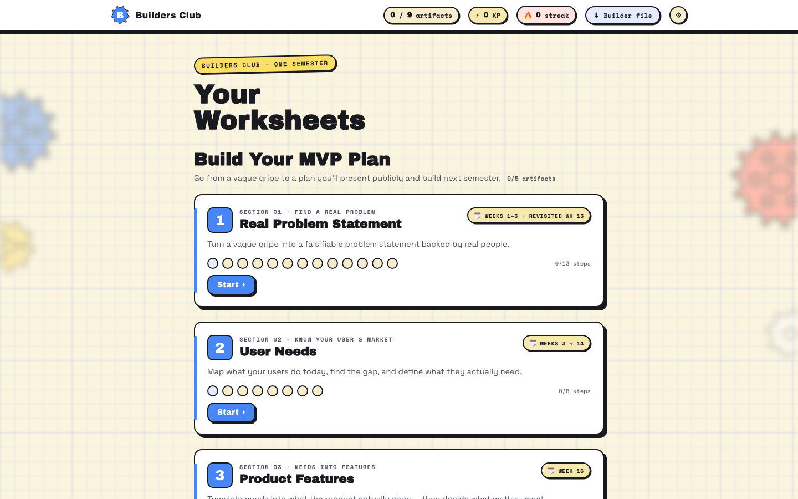
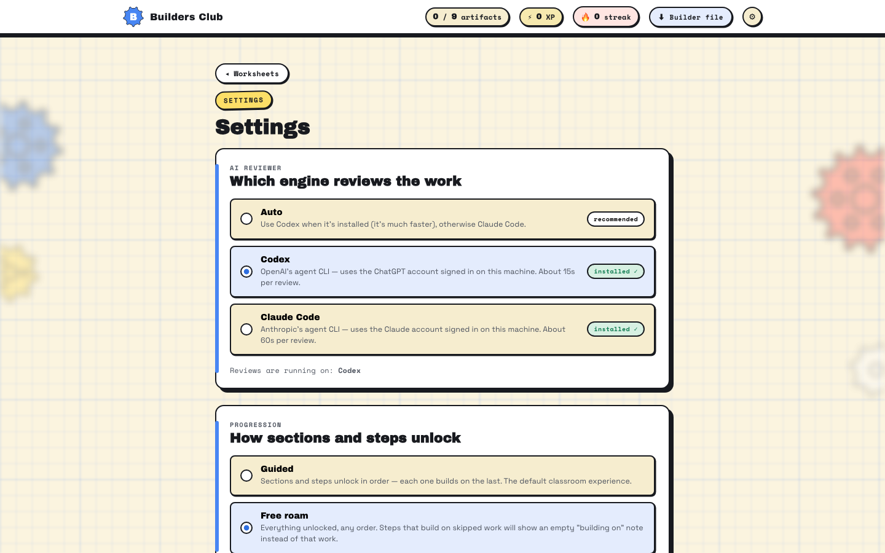

# Builders Club — Semester Worksheets

Interactive semester worksheets for Builders Club, with **AI review** built in. Students work through scaffolded chains of journals, gated video segments, and exercises; each worksheet builds on top of the previous ones allowing for a cohesive experience.




Every submission is reviewed against the step's rubric by **Codex** (OpenAI) or **Claude Code** (Anthropic). That means:

- **No API keys.** No `.env` files, no keys to buy or rotate.
- **No accounts to create.** It reuses the ChatGPT or Claude login you already have.
- **No database.** Student progress is a single JSON file on disk.

---

## What you need

| Requirement | Why | Get it |
|---|---|---|
| **Node.js 18+** | Runs the local server (no dependencies to install) | [nodejs.org](https://nodejs.org) — download the LTS installer |
| **Codex CLI** *and/or* **Claude Code** | Powers the AI reviews | Setup steps below |

You only need **one** of the two CLIs. If you have both, the app lets you switch between them in Settings.

Check whether you already have Node:

```bash
node --version
```

If that prints `v18` or higher, you're set.

---

## Step 1 — Download the worksheet demo

**Clone it — don't download the ZIP:**

```bash
git clone https://github.com/1729-Learning/Builders-Club-Worksheets.git
cd Builders-Club-Worksheets
```

Worksheets get fixed and added to during the semester, and a cloned folder can update itself in one double-click while keeping all your work (see [Getting updates](#getting-updates)). A ZIP can't — you'd have to re-download the whole thing into a new folder and move your progress across by hand.

<details>
<summary>No git installed?</summary>

On macOS, run `git --version` once and the system offers to install the Command Line Tools for you. Otherwise get it from [git-scm.com](https://git-scm.com).

</details>

---

## Step 2 — Set up an AI reviewer


### Option A: Codex

Codex is OpenAI's agent CLI. It signs in with a regular **ChatGPT account** (Plus/Pro/Team). Docs: [developers.openai.com/codex/cli](https://developers.openai.com/codex/cli)

1. Install it:

```bash
npm install -g @openai/codex
```

2. Sign in (opens your browser — choose **Sign in with ChatGPT**):

```bash
codex
```

3. Verify it works:

```bash
codex --version
```

### Option B: Claude Code

Claude Code is Anthropic's agent CLI. It signs in with a **Claude account** (Pro/Max). Docs: [claude.com/claude-code](https://claude.com/claude-code) · [setup guide](https://docs.claude.com/en/docs/claude-code/setup)

1. Install it:

```bash
npm install -g @anthropic-ai/claude-code
```

2. Start it once and follow the browser login prompt:

```bash
claude
```

3. Verify it works:

```bash
claude --version
```

---

## Step 3 — Run it

**Double-click `Start Worksheets.command`** in the `Builders-Club-Worksheets` folder. It starts the server and opens the page for you. Leave the window it opens alone while you work — closing it stops the worksheets.

<details>
<summary>macOS says it can't open the file / "unidentified developer"</summary>

The first time only: right-click `Start Worksheets.command` → **Open** → **Open** again. macOS remembers after that.
</details>

Prefer a terminal? Same thing by hand, from the same folder:

```bash
node server.js
```

Either way, open **http://localhost:4321** in your browser.

The startup log tells you which reviewer it found and which one it's using. If no CLI is detected, the app still runs — AI reviews just show a "reviewer is offline" notice until you finish Step 2.

---

## Step 4 — Choose your review engine

Click the **⚙ gear** in the top-right of the app. The Settings page shows which engines are installed and lets you switch. Your choice persists in `data/settings.json`.



- **Codex** — tested to be slightly faster.
- **Claude Code** — gives better feedback sometimes.
- Until you pick one, it uses Codex when installed, otherwise Claude Code.

Settings also controls **progression**: *Guided* (sections unlock in order — the default classroom experience) vs *Free roam* (everything unlocked, any order).

---

## Using the worksheets


- **Video steps** plays a segment of a YouTube video thats been picked for its quality.
- **Exercise steps** are reviewed by the AI against that step's rubric. The goal is to iterate towards a good response, not to get graded or rush towards completion.
- **Journal steps** are private reflections; the AI can reference them later to connect ideas.
- Finished sections mint **artifacts** — the tangible outputs (problem statement, MVP plan, …).

Progress, XP, and streaks live in `data/state.json`. Delete that file to reset everything to a fresh student.

---

## Getting updates

**Double-click `Update Worksheets.command`.** 

**Your work is never at risk.** Everything you've written — answers, artifacts, XP, streak — lives in the `data/` folder, which git ignores completely. Updating only replaces the worksheet files themselves. There is nothing to back up and nothing to migrate.

You can also do it by hand if you prefer:

```bash
git pull --rebase --autostash
```

Then **restart the server.**

<details>
<summary>Instructor note — editing content while students are mid-worksheet</summary>

Progress is denoted by **id** (`"sectionId/stepId"`), stored separately from content, so most edits land safely on a student who's halfway through. Free to change any time: prompts, placeholders, rubrics, lesson panels, reviewer notes, titles, videos and their timestamps, week chips, `buildsOn`, resources — plus adding steps, sections or whole worksheets, and reordering steps.

There are only 3 edits to look out for that cause issues with student work:

1. **Renaming a step or section `id`.** The answer stays in `state.json` but nothing looks for it, and the step reads as untouched. Change titles freely; treat ids as permanent. (`pick-top-5` keeps that id even though it now says "top 3" — that's the pattern.)
2. **Deleting a step or section** that students have answered.
3. **Converting a step to or from a `board`.** Text and list answers share one string field, so textarea ↔ list is safe; boards use a separate field and won't show the old answer. Raising a `min` or `minPerSide` can also make an already-passed step fail on redo.
</details>

---

## Configuration reference


| Env var | Default | What it does |
|---|---|---|
| `PORT` | `4321` | Server port |
| `REVIEW_BACKEND` | `auto` | `codex`, `claude`, or `auto`. The ⚙ Settings page overrides this and persists to `data/settings.json`. |
| `REVIEW_MODEL` | `haiku` | Claude backend model (`haiku` = fast, `sonnet` = smarter) |
| `CODEX_MODEL` | CLI default | Codex backend model override (e.g. `gpt-5.1-codex-mini`) |

Example:

```bash
PORT=5000 REVIEW_BACKEND=claude REVIEW_MODEL=sonnet node server.js
```

---

## Troubleshooting

| Symptom | Fix |
|---|---|
| Reviews say "the AI reviewer is offline" | The active engine's CLI isn't installed or isn't logged in. Run `codex --version` / `claude --version` to check, re-run the sign-in from Step 2, or switch engines in ⚙ Settings. |
| `node: command not found` | Install Node.js from [nodejs.org](https://nodejs.org), then reopen your terminal. |
| macOS won't open a `.command` file | First time only: right-click it → **Open** → **Open**. |
| Port 4321 already in use | Run with another port: `PORT=5000 node server.js` |
| `Update Worksheets` says the folder was downloaded as a ZIP | A ZIP has no git history to update from. Clone the repo instead (Step 1), then copy your old `data/` folder into the new one to keep your work. |
| Update ran but the worksheets look unchanged | Restart the server — `Update Worksheets.command` does this automatically, but a manual `git pull` doesn't. |
| Want a clean slate | Stop the server and delete `data/state.json`. |
| Reviews feel slow | Switch to Codex in ⚙ Settings (~15s vs ~60s), or keep working — reviews run in the background per step. |

---

## How content works

All worksheet content — worksheets, sections, steps, video segments, rubrics, role-plays — lives in [`content.js`](content.js). **Adding a worksheet is config, not code.** Video segments reference YouTube IDs with `start`/`end` times; swap them freely.

The server ([`server.js`](server.js)) is a single dependency-free Node file: it serves the static app, persists state, and shells out to the chosen CLI for reviews. The front-end ([`public/app.js`](public/app.js)) is a hash-routed single-page app, no framework, no build step.
